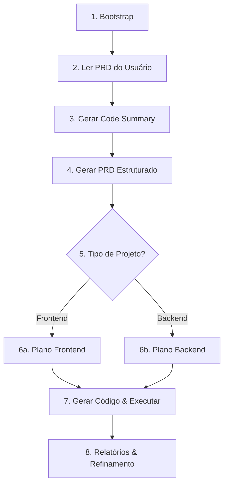

# TestSprite MCP Skill

Skill especializada em integrar o **TestSprite MCP Server** ao ecossistema Nexus 7 Agent. Fornece um workflow completo de 8 estágios para testes automatizados de Frontend (UI) e Backend (API), desde o bootstrap até relatórios e refinamento.

## Quando Usar Esta Skill

- O usuário solicita testar um projeto com TestSprite
- Necessidade de gerar suíte completa de testes automatizados
- Precisa analisar cobertura de testes para Frontend (Playwright) ou Backend (Python)
- Quer integrar testes MCP no pipeline harness do Nexus
- Precisa de relatórios de teste com screenshots, vídeos e análise de falhas
- Deseja re-executar testes refinados após correções

## Quando NÃO Usar Esta Skill

- Testes unitários isolados (use frameworks nativos como Jest, Vitest)
- Testes de carga/performance (não é o foco do TestSprite)
- O TestSprite MCP Server não está instalado ou configurado
- O projeto não tem uma aplicação executável (Frontend ou Backend)

## Workflow

### Workflow de 8 Estágios do TestSprite MCP

O TestSprite MCP fornece 8 ferramentas que devem ser executadas em sequência:



### Estágio 1: Bootstrap (testsprite_bootstrap_tests)

Inicializar ambiente de teste e configuração.

```javascript
testsprite_bootstrap_tests({
  localPort: <porta_da_aplicacao>,
  type: "frontend" | "backend",
  projectPath: "<caminho_absoluto>",
  testScope: "codebase" | "diff"
})
```

**Parâmetros:**
- `localPort` (number, default: 5173) — Porta onde a aplicação está rodando
- `path` (string, opcional) — Path específico para testar
- `type` (string) — "frontend" ou "backend"
- `projectPath` (string) — Caminho absoluto do projeto
- `testScope` (string) — "codebase" (completo) ou "diff" (mudanças recentes)

### Estágio 2: Ler PRD do Projeto

Ler o Product Requirements Document fornecido pelo usuário (se existir). O PRD é fortemente recomendado pois melhora significativamente a qualidade dos planos de teste.

### Estágio 3: Code Summary (testsprite_generate_code_summary)

Analisar código-fonte e gerar resumo arquitetural.

```javascript
testsprite_generate_code_summary({
  projectRootPath: "<caminho_absoluto>"
})
```

Gera `code_summary.json` com análise de arquitetura, frameworks, dependências e mapeamento de features.

### Estágio 4: PRD Estruturado (testsprite_generate_standardized_prd)

Gerar PRD padronizado a partir da análise do código.

```javascript
testsprite_generate_standardized_prd({
  projectPath: "<caminho_absoluto>"
})
```

Gera `standard_prd.json` com overview do produto, user stories, requisitos funcionais e especificações técnicas.

### Estágio 5: Tipo de Projeto + Plano de Testes

**Para Frontend** — `testsprite_generate_frontend_test_plan`:
```javascript
testsprite_generate_frontend_test_plan({
  projectPath: "<caminho_absoluto>",
  needLogin: true | false
})
```
Gera `frontend_test_plan.json` com casos de UI, formulários, navegação, regressão visual e autenticação.

**Para Backend** — `testsprite_generate_backend_test_plan`:
```javascript
testsprite_generate_backend_test_plan({
  projectPath: "<caminho_absoluto>"
})
```
Gera `backend_test_plan.json` com testes de API, integração, banco de dados, autenticação e erro.

### Estágio 6: Geração e Execução (testsprite_generate_code_and_execute)

Gerar e executar a suíte completa de testes.

```javascript
testsprite_generate_code_and_execute({
  projectName: "<nome_do_projeto>",
  projectPath: "<caminho_absoluto>",
  testIds: [], // Array de IDs específicos ou vazio para todos
  additionalInstruction: "<instrucoes_adicionais>"
})
```

**Resultados gerados:**
- Arquivos de teste individuais (`TC001_*.py`, etc.)
- `testsprite_tests/tmp/test_results.json`
- `tmp/report_prompt.json` — análise AI
- `TestSprite_MCP_Test_Report.md` — relatório legível
- `TestSprite_MCP_Test_Report.html` — relatório HTML

### Estágio 7: Dashboard (testsprite_open_test_result_dashboard)

Reabrir dashboard para revisão de execuções passadas.

```javascript
testsprite_open_test_result_dashboard()
```

### Estágio 8: Rerun (testsprite_rerun_tests)

Re-executar testes previamente gerados com refinamentos.

```javascript
testsprite_rerun_tests({
  projectPath: "<caminho_absoluto>"
})
```

## Fluxo de Integração com o Pipeline Nexus

O agente `testsprite-mcp-agent` se integra ao pipeline de 5 estágios do Nexus:

| Estágio Nexus | Ação do TestSprite Agent |
|---|---|
| **PLAN** | Verificar pré-requisitos (Node.js, API key, app rodando). Definir tipo de projeto e escopo |
| **ANALYZE** | Executar bootstrap + code summary + PRD. Analisar arquitetura |
| **BUILD** | Gerar planos de teste (frontend/backend) + executar `generate_code_and_execute` |
| **REVIEW** | Analisar relatórios, screenshots, vídeos. Identificar falhas |
| **DOCUMENT** | Registrar resultados com `nexus-log`, salvar contexto com `nexus-memory` |

## Estrutura de Arquivos Gerados

```
<projeto>/
├── testsprite_tests/
│   ├── tmp/
│   │   ├── prd_files/              # PRDs temporários
│   │   ├── config.json             # Config do projeto
│   │   ├── code_summary.json       # Análise de código
│   │   ├── report_prompt.json      # Dados de análise AI
│   │   └── test_results.json       # Resultados da execução
│   ├── standard_prd.json           # PRD estruturado
│   ├── TestSprite_MCP_Test_Report.md     # Relatório Markdown
│   ├── TestSprite_MCP_Test_Report.html   # Relatório HTML
│   ├── TC001_*.py                  # Testes individuais
│   ├── TC002_*.py
│   └── ...
```

## Instalação do MCP Server

Para configurar o TestSprite MCP Server no OpenCode (Nexus):

```json
{
  "mcp": {
    "testsprite": {
      "type": "local",
      "command": ["npx", "-y", "@testsprite/testsprite-mcp@latest"],
      "environment": {
        "API_KEY": "{env:TESTSPRITE_API_KEY}"
      },
      "enabled": true
    }
  }
}
```

**Pré-requisitos:**
1. Node.js >= 22
2. Conta TestSprite gratuita em https://www.testsprite.com/
3. API key gerada em Settings → API Keys
4. Variável de ambiente `TESTSPRITE_API_KEY` configurada

## Ferramentas e Permissões

| Ferramenta | Permissão | Uso na Skill |
|---|---|---|
| `bash` | allow | Verificar Node.js, npm, executar MCP tools |
| `read` | allow | Ler código, configs e relatórios |
| `write` | allow | Criar arquivos de configuração |
| `edit` | allow | Ajustar planos e configurações |
| `glob`/`grep` | allow | Localizar arquivos e padrões no projeto |
| `webfetch` | allow | Acessar documentação do TestSprite |
| `nexus-log` | allow | Log estruturado do pipeline |
| `nexus-memory` | allow | Persistir contexto entre execuções |
| `nexus-handoff` | allow | Handoff para retomada de execuções longas |
| `task` | allow | Delegar a sub-agents Nexus |

## Critérios de Qualidade

- [ ] Pré-requisitos verificados antes de cada execução (Node.js, API key, app rodando)
- [ ] Paths absolutos usados consistentemente
- [ ] `testScope` correto conforme necessidade (codebase vs diff)
- [ ] Relatórios gerados e acessíveis após execução
- [ ] Falhas documentadas com `nexus-log` (nível error)
- [ ] Handoff criado para execuções que excedem 50 passos
- [ ] Testes refinados e re-executados quando necessário
