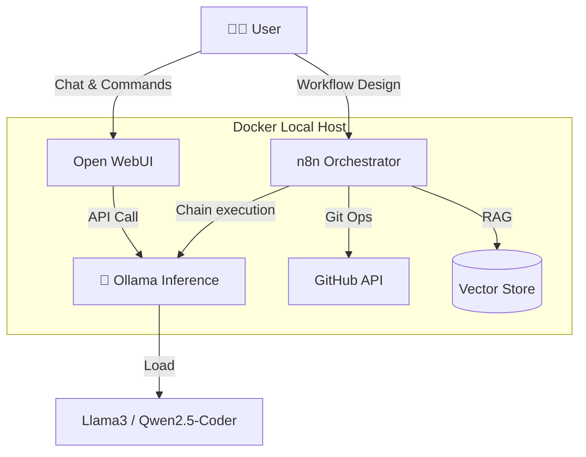

# Nexus 7 Agent 🤖


**Nexus 7 Agent** é um ecossistema de Agentes de IA 100% local, projetado para orquestração de tarefas, automação de código e gestão de conhecimento pessoal sem depender de APIs externas pagas.

O projeto utiliza **Docker** para containerização, **Ollama** como motor de inferência (LLM) e **n8n** como cérebro lógico e conector de ferramentas.

## 🏗️ Arquitetura



## 🚀 Funcionalidades

- **Local Privacy First:** Nenhum dado sai da sua máquina a menos que explicitamente configurado.
- **Code Assistant:** Integração com GitHub para Code Reviews autônomos.
- **Workflow Automation:** Fluxos complexos visuais via n8n.
- **Multi-Model Support:** Alternância fácil entre modelos (ex: DeepSeek para raciocínio, Qwen para código).

## 🛠️ Tech Stack

- **Infra:** Docker & Docker Compose
- **LLM Engine:** Ollama (Suporte a GGUF)
- **Orchestration:** n8n (Self-hosted)
- **UI:** Open WebUI (Opcional)

## ⚡ Quick Start

### Pré-requisitos
- Docker & Docker Compose instalados.
- GPU (NVIDIA) recomendada para melhor performance, mas roda em CPU.

### Instalação

1. Clone o repositório:
   ```bash
   git clone [https://github.com/SEU_USUARIO/nexus-7-agent.git](https://github.com/SEU_USUARIO/nexus-7-agent.git)
   cd nexus-7-agent
   ```

2. Configure as variáveis de ambiente:
   ```bash
   cp .env.example .env
   # Edite o .env com suas chaves (se necessário para GitHub, etc)
   ```

3. Suba o stack:
   ```bash
   docker-compose up -d
   ```

4. Baixe o modelo de IA (Exemplo):
   ```bash
   docker exec -it ollama ollama run qwen2.5-coder:7b
   ```

### Acessando os Serviços
- **n8n (Fluxos):** `http://localhost:5678`
- **Open WebUI (Chat):** `http://localhost:3000`

## 🧠 Workflows Inclusos

Os fluxos de automação estão salvos na pasta `/workflows`. Para importar:
1. Abra o n8n.
2. Vá em "Workflows" > "Import from File".
3. Selecione o arquivo JSON desejado.

## 🤝 Contribuição

Sinta-se livre para abrir Issues e Pull Requests para melhorar os fluxos do Nexus 7.

## 📄 Licença

[MIT](LICENSE)