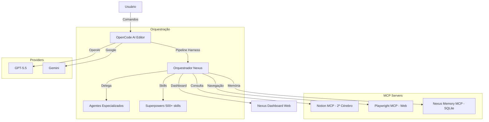

# Nexus 7 Agent


**Nexus 7 Agent** é um ecossistema de Agentes de IA para orquestração de tarefas, automação de código e gestão de conhecimento, construído sobre o OpenCode com pipeline harness de 5 estágios.

## 🏗️ Arquitetura



## 🚀 Funcionalidades

- **Pipeline Harness de 5 Estágios:** PLAN → ANALYZE → BUILD → REVIEW → DOCUMENT
- **Agentes Especializados:** Delegação inteligente para sub-agents (segurança, QA, documentação, testes)
- **MCP Servers:** Integração com Notion (segundo cérebro) e Playwright (navegação web)
- **Memória Persistente:** Contexto entre sessões via SQLite + FTS5
- **Dashboard Web:** UI visual para logs, memória e handoffs
- **Multi-Provider:** Suporte a OpenAI e Google Gemini

## 🛠️ Tech Stack

| Camada | Tecnologia |
|--------|-----------|
| **Orquestrador** | OpenCode + oh-my-opencode-slim |
| **LLM Providers** | OpenAI (GPT-5.5), Google (Gemini) |
| **MCP Servers** | Notion, Playwright, Nexus Memory |
| **Plugin System** | Superpowers (500+ skills), Nexus Plugin |
| **Pipeline** | Harness de 5 estágios (PLAN → ANALYZE → BUILD → REVIEW → DOCUMENT) |
| **Custom Tools** | nexus-log, nexus-memory, nexus-handoff |
| **Dashboard** | Nexus Dashboard (Express Web UI) |
| **Storage** | SQLite com FTS5 |

## ⚡ Quick Start

### Pré-requisitos
- [OpenCode](https://opencode.ai) instalado
- Node.js 18+
- Chaves de API para os providers desejados

### Instalação

1. Clone o repositório:
   ```bash
   git clone https://github.com/oN0V41S/nexus-7-agent.git
   cd nexus-7-agent
   ```

2. Configure as variáveis de ambiente:
   ```bash
   cp .env.examle .env
   # Edite o .env com suas chaves
   ```

3. Abra o projeto no OpenCode:
   ```bash
   opencode .
   ```

## 🧠 Agentes do Ecossistema

| Agente | Modo | Função |
|--------|------|--------|
| `@orchestrator` | primary | Orquestrador principal do pipeline |
| `@security-secret-auditor` | subagent | Auditoria de segurança |
| `@quality-assurance-analyst` | subagent | Testes e validação |
| `@docs-architect` | subagent | Documentação técnica |
| `@testsprite-mcp-agent` | subagent | Testes automatizados |

## 📋 Comandos

| Comando | Descrição |
|---------|-----------|
| `/pipeline` | Inicia o pipeline harness |
| `/plan` | Planeja feature |
| `/security` | Auditoria de segurança |
| `/qa` | Testes e qualidade |
| `/docs` | Documentação técnica |
| `/memory` | Consulta memória persistente |
| `/commit-&-docs` | Commit + documentação |

## 📄 Licença

[MIT](LICENSE)
