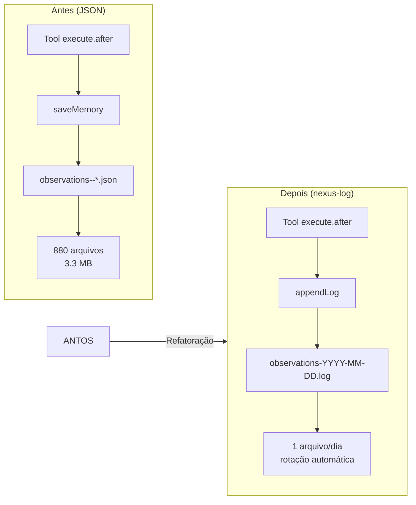
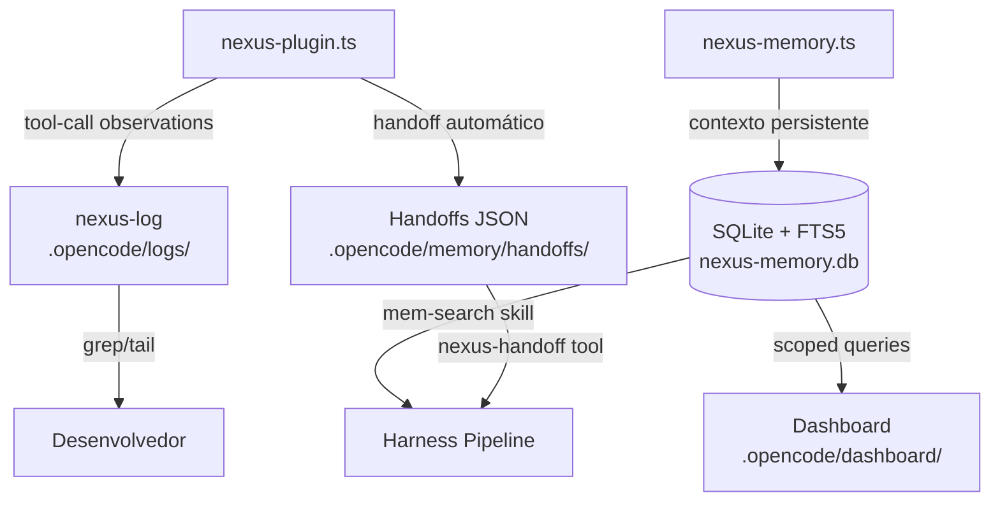
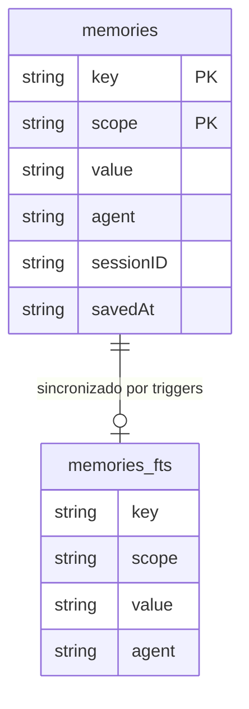

# Otimização do Sistema de Memória/Observações — Documentação Técnica

> **Spec:** `docs/spec/otimizacao-memoria-nexus.spec.md`
>
> **Estado:** Implementado (v1.0.0) — 2026-05-21

---

## Sumário

1. [Sistema de Observações: JSON → nexus-log](#1-sistema-de-observacoes-json--nexus-log)
2. [Nexus-Memory: Schema e Índices SQLite](#2-nexus-memory-schema-e-indices-sqlite)
3. [Configuração de Modelos: ProviderModelNotFoundError](#3-configuracao-de-modelos-providermodelnotfounderror)
4. [Diagrama de Arquitetura](#4-diagrama-de-arquitetura)

---

## 1. Sistema de Observações: JSON → nexus-log

### O Problema

O plugin Nexus (`nexus-plugin.ts`) registrava automaticamente observações de tool-calls (write, edit, bash, task, skill) em arquivos JSON individuais:

```
.opencode/memory/observations--tool-call_<callID>.json
```

Cada tool-call gerava um arquivo separado. O resultado: **880 arquivos** (3.3 MB) acumulados, sem política de retenção, e nenhum processo no harness consultava esses arquivos.

### A Solução

As observações foram redirecionadas para o **sistema de rotação de logs do nexus-log**, que já gerenva logs categorizados por data.

#### Antes (JSON)

```typescript
// ❌ REMOVIDO — saveMemory() escrevia um arquivo JSON por observação
function saveMemory(worktree, key, value, scope, agent, sessionID) {
  const filePath = path.join(memDir, `${scope}--${key}.json`);
  fs.writeFileSync(filePath, JSON.stringify(entry, null, 2), "utf-8");
}
```

#### Depois (nexus-log)

```typescript
// ✅ appendLog() com categoria "observations" — rotação por data
appendLog(
  worktree,
  "INFO",
  "observations",
  `Tool: ${input.tool} — ${output.title}`,
  {
    tool: input.tool,
    title: output.title,
    outputSize: output.output?.length || 0,
    sessionID: input.sessionID,
    agent: input.agent || "plugin",
    duration,
  },
);
```

### Como Funciona o Sistema de Logs

O `appendLog()` escreve entradas em arquivos rotacionados por data:

```
.opencode/logs/
├── tools-YYYY-MM-DD.log         # Métricas de execução de ferramentas
├── observations-YYYY-MM-DD.log  # Observações de tool-calls (antes era JSON)
├── commands-YYYY-MM-DD.log      # Comandos executados
├── session-YYYY-MM-DD.log       # Rastreamento de sessão
├── plugin-YYYY-MM-DD.log        # Eventos do ciclo de vida do plugin
└── permissions-YYYY-MM-DD.log   # Solicitações de permissão
```

Formato de cada entrada:

```
[2026-05-21T10:30:00.000Z] [INFO] Tool: write — Cria arquivo de configuração {"tool":"write","title":"Cria arquivo...","outputSize":1234,"sessionID":"abc123","agent":"orchestrator","duration":1500}
```

### Por que isso é melhor

| Aspecto | Antes (JSON) | Depois (nexus-log) |
|---|---|---|
| Armazenamento | 1 arquivo por observação | 1 arquivo por dia |
| Retenção | Ilimitada (acumulava) | Rotação natural por data |
| Consulta | Só lendo arquivos individuais | `grep` ou `tail` nos logs |
| Metadata | Fields soltos no JSON | Estruturado + JSON inline |
| Impacto em disco | 3.3 MB em 880 arquivos | ~1 KB/dia em log texto |

### Dead Code Removido

A função `saveMemory()` foi completamente removida do `nexus-plugin.ts`, junto com seu import de `node:path` onde não mais necessário. Nenhum outro módulo dependia dela.

---

## 2. Nexus-Memory: Schema e Índices SQLite

### Schema da Tabela `memories`

```sql
CREATE TABLE memories (
  key       TEXT NOT NULL,         -- Chave única dentro do escopo
  scope     TEXT NOT NULL DEFAULT 'session', -- session | project | agent
  value     TEXT NOT NULL,         -- Valor JSON serializado
  agent     TEXT,                  -- Nome do agente que salvou
  sessionID TEXT,                  -- Sessão que originou
  savedAt   TEXT NOT NULL DEFAULT (datetime('now')), -- ISO-8601
  PRIMARY KEY (key, scope)
);
```

### Full-Text Search (FTS5)

```sql
CREATE VIRTUAL TABLE memories_fts USING fts5(
  key, scope, value, agent,
  content='memories',
  content_rowid='rowid',
  tokenize='porter unicode61'
);
```

Três triggers mantêm o índice FTS sincronizado automaticamente:

| Trigger | Evento | Ação |
|---|---|---|
| `memories_ai` | `AFTER INSERT` | Insere na FTS |
| `memories_ad` | `AFTER DELETE` | Remove da FTS |
| `memories_au` | `AFTER UPDATE` | Remove antigo + insere novo |

### Índices de Performance

Adicionados na v3 para acelerar queries comuns:

```sql
-- (1) Query por escopo ordenada por data (mais usado: listagem do dashboard)
CREATE INDEX idx_memories_scope_savedat ON memories(scope, savedAt DESC);

-- (2) Query de listagem geral (ORDER BY savedAt DESC)
CREATE INDEX idx_memories_savedat ON memories(savedAt DESC);

-- (3) Query por agente (futuro: dashboard por agente)
CREATE INDEX idx_memories_agent ON memories(agent);

-- (4) Query por sessão (futuro: limpeza por sessão)
CREATE INDEX idx_memories_session ON memories(sessionID);
```

### Mapa de Queries vs Índices

| Query SQL | Índice Usado | Antes | Depois |
|---|---|---|---|
| `ORDER BY savedAt DESC LIMIT ?` | `idx_memories_savedat` | Full table scan | Index scan |
| `WHERE scope = ? ORDER BY savedAt DESC` | `idx_memories_scope_savedat` | Full table scan | Index scan |
| `WHERE agent = ?` | `idx_memories_agent` | Full table scan | Index scan |
| `WHERE sessionID = ?` | `idx_memories_session` | Full table scan | Index scan |

### Verificação

Para verificar os índices ativos no banco:

```bash
sqlite3 .opencode/memory/nexus-memory.db ".indices"
# → idx_memories_agent
# → idx_memories_session
# → idx_memories_savedat
# → idx_memories_scope_savedat
# → sqlite_autoindex_memories_1  (PK implícito)
```

### Handoffs

Manifestações de handoff continuam como JSON em `.opencode/memory/handoffs/` (não foram migrados para SQLite). Cada handoff é um arquivo:

```
.opencode/memory/handoffs/handoff-<timestamp>-<random>.json
```

---

## 3. Configuração de Modelos: ProviderModelNotFoundError

### O Problema

Sub-agents encontravam `ProviderModelNotFoundError` porque:

1. **`oh-my-opencode-slim.json`** — O preset `openai` no `oh-my-opencode-slim.json` hardcoda modelos `openai/gpt-5.5`, `openai/gpt-5.4-mini`, etc. como `DEFAULT_MODELS`.
2. **`opencode.json`** — O provider `openai` **não está configurado** em `opencode.json` (só `opencode` e `gemini`).
3. **Herança de modelo** — Quando um sub-agent não tem `model` explicitamente, ele tenta herdar o modelo do agente pai, que pode referenciar um provider não configurado.

### A Solução

1. **Override do preset `nexus-hybrid`**: Todos os agentes em `oh-my-opencode-slim.json` foram configurados para usar `opencode/big-pickle`.

2. **Agentes em `opencode.json`**: Nenhum `model` field é necessário nos agentes de `opencode.json`, porque o preset cuida disso. Mas se você definir `model` em agentes, use `"opencode/big-pickle"`.

### Configuração Atual

**`oh-my-opencode-slim.json`** — preset `nexus-hybrid`:

```json
{
  "preset": "nexus-hybrid",
  "presets": {
    "nexus-hybrid": {
      "orchestrator": {
        "model": "opencode/big-pickle",
        "variant": "low",
        "skills": ["*"],
        "mcps": ["*", "!context7"]
      },
      "oracle": {
        "model": "opencode/big-pickle",
        "variant": "high"
      },
      "explorer": {
        "model": "opencode/big-pickle",
        "variant": "low"
      },
      "fixer": {
        "model": "opencode/big-pickle",
        "variant": "low"
      }
      // ... todos os demais agentes com "opencode/big-pickle"
    }
  }
}
```

### Troubleshooting — ProviderModelNotFoundError

Se você encontrar este erro, siga:

1. **Verifique o preset ativo**:
   ```bash
   grep '"preset"' ~/.config/opencode/oh-my-opencode-slim.json
   ```

2. **Certifique-se que o preset `nexus-hybrid` está configurado** e que TODOS os agentes dentro dele usam `opencode/big-pickle` (ou outro modelo cujo provider exista em `opencode.json`).

3. **Verifique os providers em `opencode.json`**:
   ```bash
   jq '.provider | keys' opencode.json
   ```
   Deve retornar `["opencode", "gemini"]`. Se `"openai"` aparecer aqui sem credenciais válidas, isso também causará erro.

4. **Reinicie a sessão**: A configuração de agentes/modelos é cacheada no startup do OpenCode. Após alterar `oh-my-opencode-slim.json` ou `opencode.json`, inicie uma **nova sessão**.

5. **Teste após o restart**:
   ```
   /pipeline "tarefa simples de teste"
   ```
   Se sub-agents (como `@docs-architect`) funcionarem sem erro de modelo, o problema está resolvido.

### Práticas Recomendadas

- **Não** defina `model` nos agentes em `opencode.json` a menos que precise de um modelo específico diferente do preset.
- **Mantenha** o preset `nexus-hybrid` como padrão e com todos os agentes mapeados.
- **Provider mapping**: Só referencie modelos de providers que existem em `opencode.json`.

---

## 4. Diagrama de Arquitetura

### Fluxo de Observações (Antes vs Depois)



### Sistema de Armazenamento Nexus



### Modelo de Dados SQLite



---

## Referências

| Arquivo | Propósito |
|---|---|
| `.opencode/plugins/nexus-plugin.ts` | Plugin Nexus (observações, handoffs, métricas) |
| `.opencode/tools/nexus-memory.ts` | Tool de memória SQLite |
| `.opencode/memory/nexus-memory.db` | Banco SQLite |
| `.opencode/memory/handoffs/` | Handoffs em JSON |
| `.opencode/logs/` | Logs rotacionados (observations, tools, etc.) |
| `opencode.json` | Configuração de agentes, providers, permissões |
| `~/.config/opencode/oh-my-opencode-slim.json` | Presets de modelos multi-agente |
| `docs/spec/otimizacao-memoria-nexus.spec.md` | Spec original da otimização |

---

## Histórico de Revisões

| Versão | Data | Autor | Mudanças |
|---|---|---|---|
| 1.0.0 | 2026-05-21 | Docs Architect | Criação inicial com documentação das 3 mudanças |
